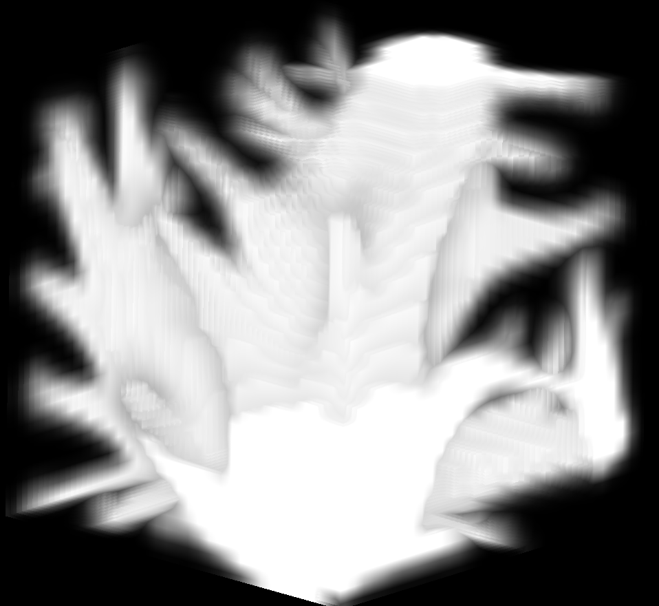

# Thermoelastic

These problems represent multi-physics topology optimization problems that capture the coupling between structural and thermal domains.


<div style="margin-left: 300px; display: flex; justify-content: center; gap: 20px; flex-direction: column; align-items: center;">
    <div style="display: flex; justify-content: center; gap: 20px;">
        
        
    </div>
    <div style="text-align: center;">Left: 2D version, Right: 3D version</div>
</div>


We provide two versions for this problem:
- [Thermoelastic2D](./thermoelastic2d.md) A 2D multi-physics topology optimization problem.
- [Thermoelastic3D](./thermoelastic3d.md) The 3D extension of the thermoelastic problem.

```{toctree}
:hidden:

./thermoelastic2d
./thermoelastic3d
```
